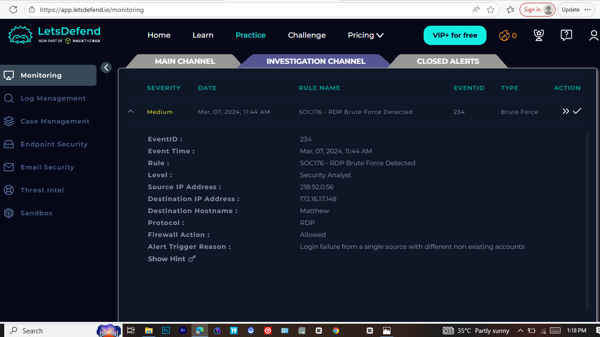

# Brute Force Login Attempt – SOC Incident Report

## Incident Information
- **Platform:** LetsDefend
- **Alert Title:** Brute Force Login Attempt
- **Severity:** Medium
- **Category:** Authentication / Brute Force
- **Date & Time Detected:** 11:44 AM
- **Analyst:** Bamgbopa Opemipo

---

## Incident Summary
A security alert was triggered due to multiple failed login attempts detected within a short time window. The alert was investigated to determine whether the activity represented malicious behavior or normal user activity.

---

## Investigation Details
After taking ownership of the alert, authentication logs were reviewed to identify patterns related to login attempts.

### Key Findings
- **Total Failed Login Attempts:** 30
- **Time Window:** Same minute (11:44 AM)
- **Source IP Address:** Same source IP observed across multiple attempts
- **Targeted Account:** Single user account

The activity showed automated behavior consistent with a brute force attack.

---

## Evidence

### Screenshot 1: Authentication Logs
Multiple failed login attempts occurring within a short time window.

### Screenshot 2: Alert Summary
Alert details showing severity and classification.

---

## Incident Classification
- **True Positive**

---

## Reason for Classification
The alert was classified as a true positive due to the unusually high number of failed login attempts occurring within the same minute from the same source IP, which is not consistent with normal user behavior and aligns with known brute force attack patterns.

---

## Response and Actions Taken
- Alert ownership was taken
- Logs were analyzed
- Incident was classified as a true positive
- Alert was closed after documentation

---

## Lessons Learned
This investigation highlights the importance of identifying authentication patterns and analyzing login behavior to detect brute force attacks. If successful, this activity could have resulted in unauthorized account access.

---

## Final Notes
This report documents a completed SOC alert investigation conducted on the LetsDefend platform and demonstrates hands-on experience in security monitoring and incident response.

