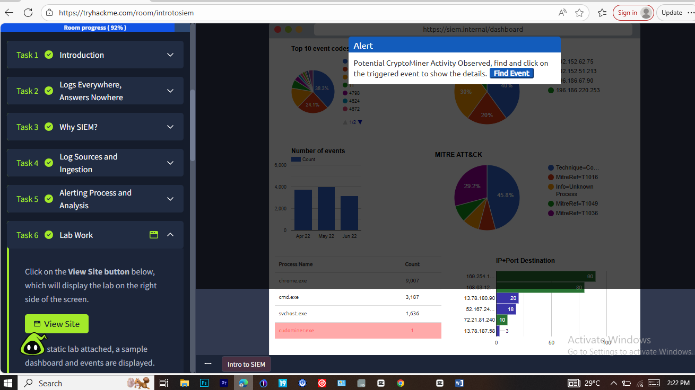
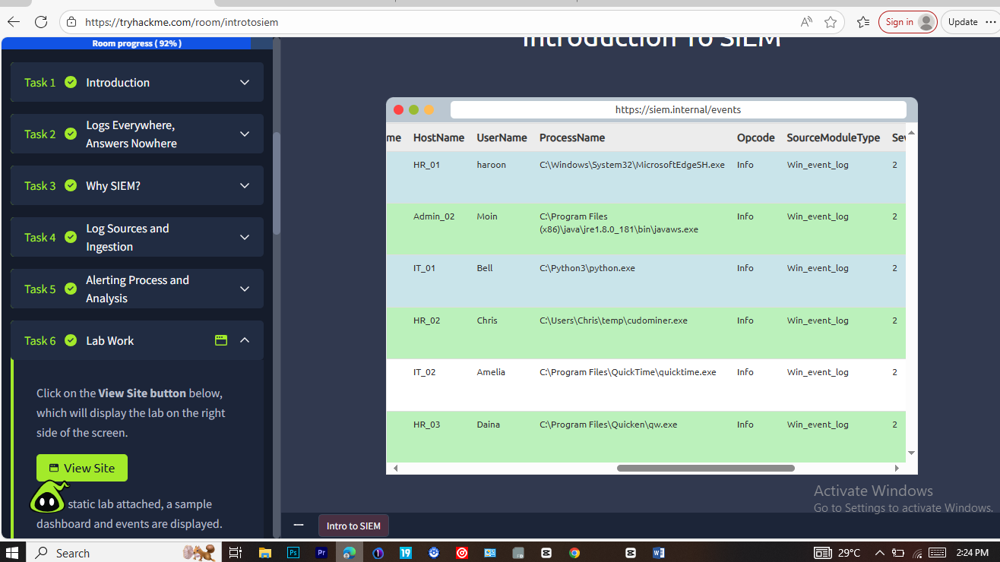

# TryHackMe Incident Report: Intro to SIEM

## Analyst
Bamgbopa Opemipo

## Platform
TryHackMe

## Room Name
Intro to SIEM

## Difficulty
Beginner

## Incident Type
Suspicious Log Activity

## Severity
Medium

## Date
January 21, 2026

---

## 1. Executive Summary
This report documents the investigation of a simulated security alert conducted as part of the TryHackMe **Intro to SIEM** room.

The objective of this exercise was to analyze log data using a Security Information and Event Management (SIEM) platform to identify patterns of suspicious activity and assess potential security risks.

---

## 2. Alert Description
A security alert was generated based on suspicious activity detected within system logs.

The alert indicated unusual behavior that required further investigation to determine whether it represented a true security incident or benign activity.

---

## 3. Tools Used
- TryHackMe SIEM platform
- Log search and filtering functionality

---

## 4. Investigation Process
The investigation followed standard SOC analysis procedures:

- Reviewed alert details and associated timestamps  
- Queried logs related to the alert  
- Analyzed event frequency and user behavior  
- Correlated events to determine potential intent  

---

## 5. Evidence Collected
The following evidence was reviewed during the investigation:

### SIEM Alert Overview

### Log Search Results

### Event Detail View

---

## 6. Findings
The analysis revealed repeated log events occurring within a short time window.

The frequency and pattern of these events deviated from expected baseline behavior, indicating abnormal user activity that warranted closer attention.

---

## 7. Impact Assessment
If left unmonitored, this type of activity could increase the risk of unauthorized access or misuse of system resources.

No confirmed system compromise was identified during this investigation.

---

## 8. Escalation Decision
Due to the repeated abnormal activity patterns observed, the incident was escalated for further analysis to rule out potential malicious intent.

---

## 9. Mitigation & Recommendations
As this investigation was conducted in a simulated environment, no remediation actions were performed.

In a real-world scenario, continued monitoring, alert tuning, and policy review would be recommended.

---

## 10. Conclusion
This investigation highlights the importance of SIEM tools in detecting, analyzing, and responding to security events within a Security Operations Center (SOC) environment.

